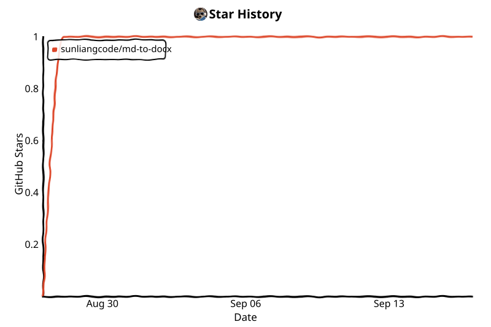

[English](README.md) | 中文

[](LICENSE)
[](https://github.com/sunliang11/md-to-docx/actions/workflows/ci.yml)


# md-to-docx

### AI 时代的开源文档编译器。

```
    AI / Markdown
          ↓
    Professional DOCX
```

[安装](#安装)
· [GitHub](https://github.com/sunliang11/md-to-docx)

---

### 为什么选择 md-to-docx？

- ✓ **AI → Word** — 把 AI 文稿编译成可交付 DOCX（[agents](references/agents.md)）
- ✓ **Markdown → DOCX** — `md-to-docx report.md --preset technical`
- ✓ **DOCX → Markdown** — `md-to-docx reverse report.docx`
- ✓ **文档对比** — 按结构对比 `.md` 与 `.docx` 版本（[roundtrip](references/roundtrip.md)）
- ✓ **模板** — 预设 + 社区 Word 模板（[presets](references/presets.md) · [templates](templates/README.md)）
- ✓ **MCP** — convert、validate、apply_template、list_presets、reverse、diff（[mcp](references/mcp.md)）
- ✓ **Cursor / Claude / Codex / Gemini** — [SKILL.md](SKILL.md) · [skills/](skills/)
- ○ **浏览器扩展** *(实验性)* — 从 ChatGPT / Claude / Gemini 对话导出 Word（[extension](browser-extension/README.md)）
- ○ **桌面右键** *(实验性)* — Finder / 资源管理器对 `.md` ↔ `.docx` 一键转换（[desktop](desktop/README.zh.md)）
- ✓ **GitHub Action** — CI 从 Markdown 构建 DOCX（[action](action/README.md)）
- ✓ **本地 & 私有** — 无需 API Key，Docker 自托管

---

### 30 秒上手

```
input.md  →  md-to-docx  →  report.docx
```

```bash
./bin/convert examples/technical-report/example.md --preset technical
```


**转换前**（Markdown）→ **转换后**（Word）

 

---

### AI 工作流

```
ChatGPT · Claude · Cursor · Codex · Gemini
                  ↓
              md-to-docx
                  ↓
            专业 Word 文档
```

[SKILL.md](SKILL.md) · [配合 AI 使用](references/agents.md) · [MCP 服务](references/mcp.md)

---

### 模板

[Technical](examples/technical-report/) · [Business](examples/business-report/) · [Academic](examples/academic-paper/) · [Chinese](examples/chinese-report/) · [API](examples/api-document/) · [Meeting](examples/meeting-notes/)

完整 [示例库](examples/README.md)。

---

### 生态

**核心：** [CLI](references/cli.zh.md) · [MCP](references/mcp.md) · [GitHub Action](action/README.md) · [Docker Playground](web/README.md)

**实验性**（需本地 CLI 或 Playground）：[VS Code](editors/vscode/README.md) · [Obsidian](editors/obsidian/README.md) · [Browser](browser-extension/README.md) · [Desktop](desktop/README.zh.md)

---

## 快速开始

**方式 A — Git 克隆（推荐，无需 pip）**

```bash
git clone https://github.com/sunliang11/md-to-docx.git
cd md-to-docx
./bin/convert path/to/report.md --preset technical
```

**方式 B — Docker Playground（无需本机 Python）**

```bash
docker compose -f web/docker-compose.yml up --build
# 浏览器打开 http://localhost:8080
```

**方式 C — 本地 Web Playground（pip + uvicorn）**

```bash
pip install -e ".[web]"
PYTHONPATH=scripts python -m md_to_docx.presets_build
uvicorn web.app:app --reload --port 8080
# 浏览器打开 http://localhost:8080
```

模式：**转换**（预设、目录、编号、社区模板、ODM 语法插入、校验、引擎预览、导出 DOCX）、**反向**（DOCX → Markdown）、**对比**（结构 diff）。MCP / 编辑器 / GitHub Action 仍见各自文档。

**方式 D — 桌面右键菜单（Finder / 资源管理器）**

需先将 `md-to-docx` 装到 `PATH`（见 [安装](#安装)），然后：

```bash
# macOS
bash desktop/macos/install.sh

# Windows (PowerShell)
powershell -ExecutionPolicy Bypass -File desktop/windows/install.ps1
```

右键 `.md` → Word；右键 `.docx` → Markdown。详情与卸载见 [desktop/README.zh.md](desktop/README.zh.md)。

## 命令

```bash
md-to-docx report.md --preset technical                              # 正向编译（默认）
md-to-docx reverse report.docx                                        # DOCX → Markdown（同目录 report.md）
md-to-docx diff draft-v1.md draft-v2.md --format md                  # 结构对比
md-to-docx report.md --plugin examples/plugins/uppercase_headings.py   # 自定义插件
md-to-docx report.md --check                                         # 仅校验
```

**完整参数说明 → [references/cli.zh.md](references/cli.zh.md)**（全部子命令、参数、安装方式与排错）。

子命令：`convert`（默认）、`reverse`、`diff`、`build`、`mcp`。旧写法 `md-to-docx file.md` 仍然有效。

**批量与目录**

```bash
md-to-docx ./docs --output-dir ./output --exclude "README.md"
md-to-docx ./docs --dry-run
```

## 你能做什么

| 做什么 | 一句话 | 试试 |
|--------|--------|------|
| **正向编译** | 把 Markdown / AI 文稿变成可交付的 Word | `md-to-docx report.md --preset technical` |
| **反向还原** | Word 转回 Markdown，方便当 Git 源文件维护 | `md-to-docx reverse report.docx` |
| **版本对比** | 按文档结构对比两版差异（支持 .md 和 .docx） | `md-to-docx diff v1.md v2.md --format md` |
| **文档校验** | 只检查 Markdown，不生成 docx | `md-to-docx report.md --check` |
| **自定义插件** | 用小型 Python 插件改写转换逻辑 | `md-to-docx report.md --plugin my_plugin.py` |
| **CI 自动化** | GitHub Actions 构建 DOCX，仓库里只留 .md | `uses: sunliang11/md-to-docx/action@v1.1.0` |
| **编辑器导出** | VS Code / Obsidian 右键一键导出 Word | [VS Code](editors/vscode/README.md) · [Obsidian](editors/obsidian/README.md) |
| **桌面右键** | Finder / 资源管理器右键 `.md` ↔ `.docx` | [desktop/README.zh.md](desktop/README.zh.md) |
| **AI 接入** | Cursor / MCP / 浏览器 — 全本地，无需 API Key | [SKILL.md](SKILL.md) · [MCP](references/mcp.md) |

**处理流程：** Markdown / AI 输出 → Document AST → 专业 DOCX（亦可反向）。

## 选择使用方式

| 入口 | 状态 | 一句话 | 文档 |
|------|------|--------|------|
| CLI | **核心** | 完整命令行工具（`md-to-docx`） | [命令手册](references/cli.zh.md) |
| `bin/convert` | **核心** | clone 后无需 `pip install` 即可运行 | — |
| Python API | **核心** | 脚本调用 `from md_to_docx.api import convert` | [development.md](references/development.md) |
| Cursor Skill | **核心** | Agent 自动选 preset 并转换 | [SKILL.md](SKILL.md) |
| Claude / Codex / Gemini | **核心** | 各平台 Skill 副本 | [skills/](skills/) |
| MCP | **核心** | 四个工具：convert、validate、apply_template、list_presets | [mcp.md](references/mcp.md) |
| Web Playground | **核心** | 浏览器编辑并下载 DOCX（Docker） | [web/README.md](web/README.md) |
| GitHub Action | **核心** | CI 从 Markdown 构建 DOCX | [action/README.md](action/README.md) |
| 浏览器扩展 | 实验性 | 从 ChatGPT / Claude / Gemini 导出（需本地 Playground） | [browser-extension/README.md](browser-extension/README.md) |
| VS Code | 实验性 | 本地 VSIX / 开发宿主 — 未上架 Marketplace | [editors/vscode/README.md](editors/vscode/README.md) |
| Obsidian | 实验性 | 手动安装 — 尚无设置界面 | [editors/obsidian/README.md](editors/obsidian/README.md) |
| Finder / 资源管理器 | 实验性 | 一键安装系统右键菜单（`.md` / `.docx`） | [desktop/README.zh.md](desktop/README.zh.md) |

## 文档格式支持

- **Native AST 引擎** — Document AST → 专业 DOCX
- **结构** — 标题、列表、表格、代码、引用、图片、任务列表
- **脚注** — Markdown `[^id]` 渲染为上标数字 + 文末 **Notes** 节（尚非 Word `footnotes.xml`）
- **CJK** — 微软雅黑 / 宋体模板
- **Mermaid** — 安装 `mmdc` 时输出 PNG；否则降级为代码块
- **数学公式** — 基础 LaTeX → OMML（子集；复杂 MathML 降级为纯文本）
- **题注与交叉引用** — `{#fig:id}`、`[@fig:id]`、`Table: … {#tbl:id}`
- **目录与页码** — Word 原生域、页眉页脚
- **分页符** — Markdown 中 `<!-- pagebreak -->`
- **Frontmatter** — YAML 元数据（`title`、`author`、`date`、`toc` 等）；preset/template 仍需 CLI 参数

详见 [预设](references/presets.md)、[往返转换](references/roundtrip.md)、[插件](references/plugins.md)。

## 示例

[examples/](examples/README.md) 含 7 份示范报告：技术、商业、学术、API、会议、AI 报告、中文报告 — 各有 `example.md` 与编译好的 `example.docx`。插件示例：[examples/plugins/](examples/plugins/)。

## Git 工作流

**Markdown 进 Git，DOCX 当构建产物：**

```gitignore
dist/docx/
*.docx
```

```yaml
- uses: sunliang11/md-to-docx/action@v1.1.0
  with:
    input: docs/report.md
    preset: technical
- uses: actions/upload-artifact@v4
  with:
    name: docx
    path: dist/docx
```

详见 [action/README.md](action/README.md)。路线图：[references/roadmap.md](references/roadmap.md)。

## 社区模板

在 [`templates/`](templates/README.md) 浏览可贡献的 Word 模板：

```bash
md-to-docx report.md --template templates/technical-design/template.docx
```

贡献模板请参阅 [templates/README.md](templates/README.md) 中的 PR 清单。文档语法规范：[spec/document-markdown.md](spec/document-markdown.md)（ODM `odm-0.1`）。

## 安装

### 环境要求

- **Python 3.10+**
- **mmdc** — 仅当需要 Mermaid 渲染为图片时（[installation.md](references/installation.md)）

### 从源码（开发）

```bash
git clone https://github.com/sunliang11/md-to-docx.git
cd md-to-docx
pip install -e ".[dev]"      # 或 -e ".[mcp]" / -e ".[web]"
which md-to-docx             # 确认 CLI 已在 PATH 中
md-to-docx report.md         # 或 ./bin/convert report.md（免 pip）
```

安装方式与入口说明：[命令手册 — 怎么运行命令](references/cli.zh.md#怎么运行命令)。

**暂未发布 PyPI。** 计划包名：`md2docx-compiler` · 命令行：`md-to-docx`。请从源码安装，或使用 `pip install "git+https://github.com/sunliang11/md-to-docx.git"`。首次发布后（见 [release.md](references/release.md)）即可 `pip install md2docx-compiler`。

**Mermaid 说明：** 未安装 `mmdc` 时图表显示为源码代码块；可用 `--strict-mermaid` 强制失败。完整说明见 [installation.md](references/installation.md)。

## 文档

- **[CLI 命令手册](references/cli.zh.md)** — 全部命令、参数与安装方式
- [安装与排错](references/installation.md)
- [预设模板](references/presets.md)
- [文档校验](references/validation.md)
- [往返 / reverse / diff](references/roundtrip.md)
- [Plugin API](references/plugins.md)
- [MCP 服务](references/mcp.md)
- [配合 AI 使用](references/agents.md)
- [GitHub Action](action/README.md)
- [Web Playground](web/README.md)
- [浏览器扩展](browser-extension/README.md)
- [桌面右键菜单](desktop/README.zh.md)
- [VS Code 扩展](editors/vscode/README.md)
- [Obsidian 插件](editors/obsidian/README.md)
- [示例库](examples/README.md)
- [插件示例](examples/plugins/)
- [环境变量](references/configuration.md)
- [开发与测试](references/development.md)
- [发布流程](references/release.md)
- [路线图](references/roadmap.md)

## Cursor Skill

```bash
ln -sfn /path/to/md-to-docx ~/.cursor/skills/md-to-docx
```

详见 [SKILL.md](SKILL.md)。

## License

MIT — 见 [LICENSE](LICENSE)。

---

## Star History

GitHub 在 2026 年限制了公开 stargazer API，因此大多数仓库无法使用 `api.star-history.com` 徽章。本图表由 [`.github/workflows/star-history.yml`](.github/workflows/star-history.yml) 生成并提交到仓库。

<!-- star-history:start -->
<picture>
  <source media="(prefers-color-scheme: dark)" srcset="assets/star-history/star-history-dark.svg">
  
</picture>
<!-- star-history:end -->
